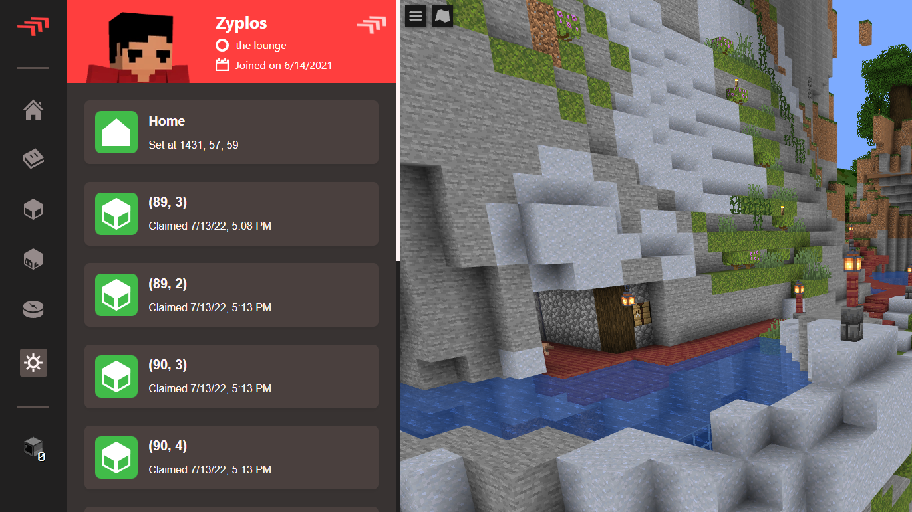

# lounge-hub

The lounge hub is a community website created to document some resources and showcase player profiles for people playing on the community's Minecraft server.

This project was built with React using Next.js. Player profiles use [BlueMap](https://github.com/BlueMap-Minecraft/BlueMap) to visualize the Minecraft world in the browser.

Minecraft player data and land claims are stored in a MySQL database using the custom [ingame plugin](https://github.com/Zyplos/LoungeCommuna).

## Project Setup

This project was made specifically for the lounge and as such has functionality that was made with this in mind. Setting up this project to work exactly as it does with the lounge will probably be a little difficult, but you are welcome to try.

This project expects a MySQL database to be configured and ready. The `.env` file contains some of the credentials and information the project needs to function.

### `bun dev`

Runs the app in the development mode.\
Open [http://localhost:3000](http://localhost:3000) to view it in the browser.

The page will reload if you make edits.\
You will also see any lint errors in the console.

This is a [Next.js](https://nextjs.org/) project bootstrapped with [`create-next-app`](https://github.com/vercel/next.js/tree/canary/packages/create-next-app). To learn more about Next.js, take a look at the following resources:

- [Next.js Documentation](https://nextjs.org/docs) - learn about Next.js features and API.
- [Learn Next.js](https://nextjs.org/learn) - an interactive Next.js tutorial.
